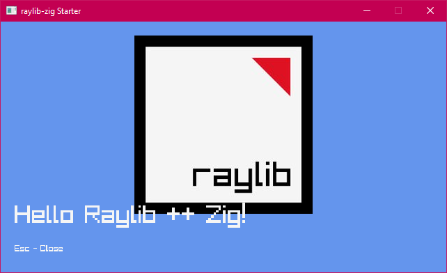

# zig_raylib_starter

Starter Zig with Raylib code created with `zig init`.

Removed the default unit tests for brevity.

Using the Raylib bindings from https://github.com/Not-Nik/raylib-zig

Included a few PowerShell scripts for convenience
